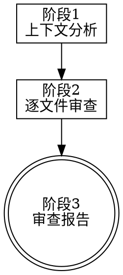

# Code Review Lite（轻量审查）

## Overview

开发完成后，根据当前会话上下文分析改动的代码，从代码质量、潜在 Bug、架构合规、安全性和 TypeScript 类型安全五个维度进行审查，输出报告和修复建议。

**核心原则：** 发现问题如实报告，不美化不遗漏。

## When to Use

- 用户说 `/审查`、"帮我审查"、"review 一下" 等
- 完成功能开发后，想在测试之前先做代码层面的检查
- 和 `/自测` 配合使用：先 `/审查`（看代码），再 `/自测`（跑测试）

## 与 /发起审查 的区别

| 维度 | /审查（本 Skill） | /发起审查       |
| ---- | ----------------- | --------------- |
| 基于 | 会话上下文        | Git diff (SHA)  |
| 方式 | AI 自己直接审查   | 派发子代理      |
| 前提 | 不需要 commit     | 需要 Git commit |
| 定位 | 轻量快速          | 正式审查流程    |

## 执行流程



## 阶段 1：上下文分析

回顾当前会话，提取：
1. **改了哪些文件** — 从会话记忆中提取所有被创建或修改的文件
2. **每个文件改了什么** — 新增函数、修改逻辑、调整样式等
3. **改动的目的** — 新功能、Bug 修复、重构、样式调整

输出改动文件清单，确认审查范围。

## 阶段 2：逐文件审查

对每个改动文件，重新阅读当前版本的代码，从 5 个维度检查：

### 🔍 代码质量
- **命名** — 变量/函数/类名是否清晰表达意图，是否一致
- **重复代码** — 是否有可提取的公共逻辑
- **复杂度** — 函数是否过长（>50行警告），嵌套是否过深（>3层警告）
- **注释** — 关键逻辑是否有必要注释，是否有过期注释
- **魔法数字** — 是否有未命名的常量

### 🐛 潜在 Bug
- **空值/未定义** — 是否有未做空值检查的属性访问（`a.b.c` 链式调用）
- **边界条件** — 数组越界、空数组、空字符串处理
- **异步问题** — Promise 未 catch、竞态条件、async/await 遗漏
- **资源泄漏** — 事件监听未移除、定时器未清理、流未关闭
- **错误处理** — catch 后是否吞掉了错误、是否有兜底逻辑

### 🏗️ 架构合规
- **模式一致性** — 是否遵循项目已有的代码组织和设计模式
- **关注点分离** — UI 组件是否混入了业务逻辑、service 是否混入了 UI 关注
- **IPC 规范** — Electron IPC 调用是否通过 `window.electron.invoke`
- **导入路径** — 是否有不合理的跨层引用

### 🔒 安全
- **硬编码敏感信息** — API Key、密码、Token 是否硬编码
- **路径拼接** — 是否有未校验的路径拼接（路径遍历风险）
- **外部输入** — 用户输入是否有做校验/清洗

### 📝 TypeScript 类型安全
- **any 滥用** — 是否有可以用具体类型替代的 `any`
- **类型断言** — `as` 断言是否安全合理
- **可选链** — 是否正确使用 `?.` 和 `??`
- **泛型** — 是否有可以用泛型减少重复的场景

## 阶段 3：审查报告

```
━━━━━━━━━━━━━━━━━━━━━━━━━━━━━━━━━━━━━━━
🔎 代码审查报告 | {日期时间}
━━━━━━━━━━━━━━━━━━━━━━━━━━━━━━━━━━━━━━━
📂 审查范围: {N} 个文件

🔴 严重问题 (Critical) — 必须修复
  1. [{文件}:{行号}] {问题描述}
     🔧 建议: {修复方法}

🟡 重要问题 (Important) — 建议修复
  1. [{文件}:{行号}] {问题描述}
     🔧 建议: {修复方法}

🔵 改进建议 (Minor) — 可选优化
  1. [{文件}:{行号}] {问题描述}
     🔧 建议: {修复方法}

✅ 做得好的地方
  - {具体的优点}

🏁 总结: {严重}个严重 / {重要}个重要 / {改进}个改进
   {是否建议立即修复}
━━━━━━━━━━━━━━━━━━━━━━━━━━━━━━━━━━━━━━━
```

### 问题分级标准

| 级别        | 标准                           | 示例                             |
| ----------- | ------------------------------ | -------------------------------- |
| 🔴 Critical  | 会导致崩溃、数据丢失、安全漏洞 | 未 catch 的 Promise、硬编码密钥  |
| 🟡 Important | 会导致 Bug 或维护困难          | 缺少空值检查、函数过长、any 滥用 |
| 🔵 Minor     | 代码风格、可读性改进           | 命名不佳、魔法数字、多余注释     |

### 报告原则

- **如实报告** — 发现问题就报，不因为"我刚写的"就放水
- **具体到行号** — 每个问题给出 `文件:行号` 定位
- **给出修复建议** — 不只说问题，还说怎么修
- **也说优点** — 做得好的地方也提，保持客观
- **不过度吹毛求疵** — 关注有实际影响的问题，不纠结缩进风格

## 审查后的选择

报告输出后，用户可以选择：
- **"帮我修"** → 直接按报告修复所有严重和重要问题
- **"只修严重的"** → 只修 Critical 级别
- **"不用改"** → 记录问题，不做修改
- **"/自测"** → 审查完接着跑测试

## Red Flags - STOP

- 没有重新阅读代码就写报告
- 报告中没有文件:行号定位
- 所有问题都标为 Minor（逃避问题）
- 发现了严重问题但没报告
- 报告全是优点没有问题（不现实）

**以上任何一条都是违规。**
