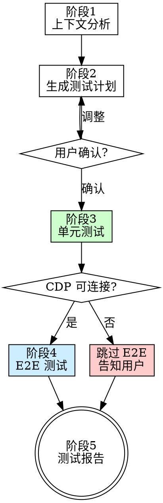

# Self-Testing（自测）

## Overview

开发完成后，根据当前会话的上下文智能分析改动内容，生成测试计划，执行单元测试和 E2E UI 测试，汇总报告。

**核心原则：** 测试覆盖改动，如实报告结果，失败不准"解释掉"。

## When to Use

- 用户说 `/自测`、"测一下"、"帮我测试" 等
- 完成一个功能或修复后，需要验证改动

## The Iron Law

```
测试计划必须展示给用户确认后才能执行
失败的测试必须如实报告，不准合理化
所有测试点跑完再出报告，不中途中断
```

## 执行流程



## 阶段 1：上下文分析

回顾当前会话，总结：
1. **做了什么** — 新功能、Bug 修复、重构、样式调整
2. **改了哪些文件** — 从会话记忆中提取
3. **分类** — 按以下规则将每个改动归类

### 文件分类规则

| 文件路径模式                    | 测试类型         |
| ------------------------------- | ---------------- |
| `electron/services/**`          | 单元测试         |
| `electron/ipc/handlers/**`      | 单元测试         |
| `electron/utils/**`             | 单元测试         |
| `src/stores/**`                 | 单元测试         |
| `*.ts`（纯逻辑/类型）           | 单元测试         |
| `src/features/**/components/**` | E2E 测试         |
| `src/features/**/*.tsx`         | E2E 测试         |
| `src/features/**/*.css`         | E2E 测试（视觉） |

**混合情况：** 如果同一功能既改了 service 又改了 UI，两种测试都生成。

## 阶段 2：生成测试计划

输出格式：

```
┌─────────────────────────────────────────────┐
│ 📋 测试计划                                  │
│                                              │
│ 🔬 单元测试 (保留):                           │
│   1. [描述] - [验证什么]                      │
│   2. [描述] - [验证什么]                      │
│                                              │
│ 🖥️ E2E 测试 (用完即弃):                      │
│   3. [描述] - [验证什么]                      │
│   4. [描述] - [验证什么]                      │
│                                              │
│ 确认执行？(y / n / 调整)                      │
└─────────────────────────────────────────────┘
```

### 测试点粒度原则

- 不求全覆盖，只测**本次改动涉及的核心行为**
- 每个测试点对应**一个可验证的断言**
- E2E 尽量简短：导航 → 操作 → 验证，3 步以内
- 用户的额外指令可以补充或覆盖自动分析的测试点

**必须等用户确认后才能执行。** 用户可以说 "y"（确认）、"去掉第3点"（调整）、"n"（取消）。

## 阶段 3：单元测试

### 生成

- 测试文件路径：`tests/unit/` + 镜像源文件的目录结构
  - 例：`electron/services/asr/ASRService.ts` → `tests/unit/services/asr/ASRService.test.ts`
- 使用 **Vitest** 框架，遵循项目已有的 `vitest.config.ts`
- 测试文件**永久保留**，成为项目测试资产

### 执行

```bash
npx vitest run tests/unit/<路径> --reporter=verbose
```

- 超时：30 秒
- 超时或崩溃标记为失败

### 结果收集

- **通过** → 记录 ✅ 继续下一个
- **失败** → 记录 ❌ + 错误信息，保留测试文件供调试，继续下一个
- **不要中断** — 一个失败不停止，跑完所有测试点

## 阶段 4：E2E 测试

### 连接检测

1. 尝试 CDP 连接 `http://localhost:9992`
2. **连接失败** → 提示 "⚠️ Electron 应用未运行（CDP 端口 9992 无响应），跳过 E2E 测试"，直接进入报告阶段
3. **连接成功** → 获取当前页面，记录原始 URL（用于测试后还原）

### 页面操作

使用 `browser_subagent` 工具执行，每个测试点独立：

1. **导航** — 点击侧边栏按钮进入目标页面
2. **交互** — 按测试计划执行点击、输入等操作
3. **DOM 断言** — 检查元素可见性、文本内容、状态属性
4. **截图** — 关键页面截图

### 视觉检查

截图后 AI 检查：
- 布局是否正常（无溢出、无重叠、无错位）
- 中文显示是否正确（无乱码、无被截断）
- 样式是否符合预期（颜色、间距、对齐）

### 状态还原

- 测试结束后导航回原始页面
- 不留下副作用（不创建数据、不修改状态）

### 临时文件

- 截图保存到 `tests/e2e-temp/screenshots/`
- 报告结束后可清理（或在下次测试时覆盖）
- 该目录已被 `.gitignore` 忽略

## 阶段 5：测试报告

```
━━━━━━━━━━━━━━━━━━━━━━━━━━━━━━━━━━━━━━━
📊 自测报告 | {日期时间}
━━━━━━━━━━━━━━━━━━━━━━━━━━━━━━━━━━━━━━━
🔬 单元测试 ({通过数}/{总数} 通过)
  ✅ {测试描述}
  ❌ {测试描述}
     错误: {具体错误信息}
     🔧 建议: {修复建议}

🖥️ E2E 测试 ({通过数}/{总数} 通过)
  ✅ {测试描述}
  ❌ {测试描述}
     📸 截图: {附图}
     🔧 建议: {修复建议}

📁 保留的测试文件:
  {文件路径列表}

🏁 总结: {通过}/{总数} 通过, {失败数} 个问题需修复
━━━━━━━━━━━━━━━━━━━━━━━━━━━━━━━━━━━━━━━
```

### 报告原则

- **如实报告** — 失败就是失败，不要"解释"为什么可以忽略
- **区分问题类型** — "功能问题"（逻辑错误）vs "样式问题"（视觉瑕疵）
- **给出修复建议** — 指出具体文件和行号
- **附截图** — E2E 失败时必须附上截图作为证据

## Red Flags - STOP

- 跳过用户确认直接执行测试
- 测试失败后说"这个可以忽略"
- 没有运行就说测试通过
- 只跑了部分测试就出报告
- E2E 测试后不还原页面状态
- 用"应该没问题"代替实际运行

**以上任何一条都是违规。**

## Common Mistakes

| 错误               | 正确做法                            |
| ------------------ | ----------------------------------- |
| 生成过多测试点     | 只测本次改动涉及的核心行为          |
| E2E 测试步骤太长   | 3 步以内：导航→操作→验证            |
| 单元测试 mock 过多 | 尽量用真实代码，mock 只在不可避免时 |
| 忘记检查 CDP 连接  | 必须先检测，失败则跳过 E2E          |
| 报告中省略失败详情 | 每个失败都要有错误信息和修复建议    |
